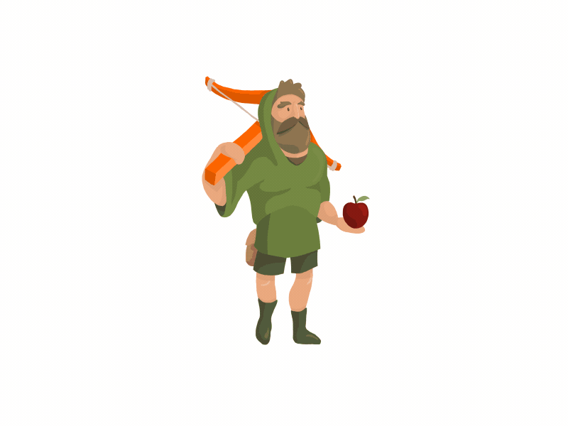
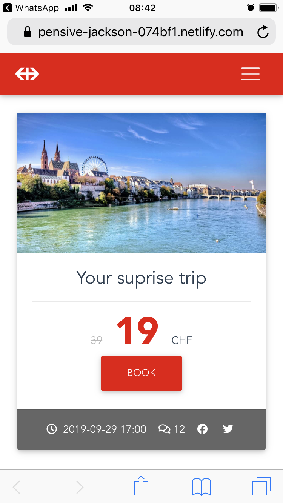
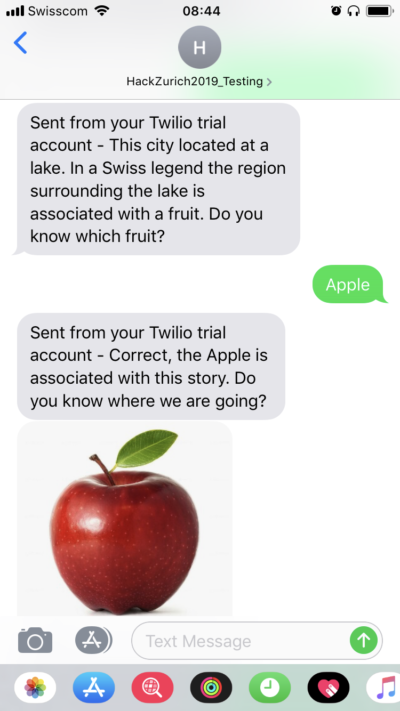

## Surprise Breathtaking Buddy
HackZurich2019 Repo
This is the GitHub repository for the BBS - Team on HackZurich2019



(Source: https://dribbble.com/shots/4368786-Migrojis-Sticker-Wilhelm-Tell )

## Challenge

No. 15 - SBB Surprise Travel

The challenge was to create a surprise travel app for Swiss Railways SBB in order to get more people to use the train instead of the car for leisure travel. The main idea is to shift travelers from peak hours with high ticket prices, to times with less occupancy and lower fares.

## Proposed Solution

Our application combines  the idea of a surprise journey into the unknown with a text based adventure game and is thus taking the experience  to another level.

Our take on the SBB - Surprise Journey guides the client on every step from the initial point of sale to the final destination. Even after boarding the train we leave the customer in the uk known about the place she is going to spend the rest of the day. Instead we present her with puzzles about the destination. In this way the customer gets to know new and interesting facts about the destination.

As we are fully aware that even in this day and age not everyone owns a smartphone, we provide an interactive experience that works on all networks, even with SMS..
We think that the social aspect of a train journey is an important one and holds great potential for improving the experience. We want to connect like minded people who embark on a  Surprise Journey by offering them the  possibility to meet during the train ride at specific places on the train such as the dining car.


## Technical Implementation

### Find and book the journey.

The service is offered through a mobile website built in vue.js . All the user needs to enter are the departure location, the desired departure time and the preference for either a hiking trip or a city-visit. Based on these parameters the SBB API generates a list of locations, from which we select the cheapest offeringy. It is then up to the user to make a choice.



### Embarking on an adventure with the client 

From start  to finish we engage the user in a conversation reminiscent of text based adventure-games. With the help of a chat-bot we guide the client through an exciting experience.
Our service makes heavy use of the messaging service Twilio to send puzzles and information about the destination to his phone as simple texts with occasional images.
This is an example of an interaction.

```
"question": "This city is located at a lake. In a Swiss legend the region surrounding the lake is associated with a fruit. Do you kow where we are going?",
"type": "adventure.FRUIT",
"validate": {
	"allowed_values": {
		"list": [
			"Apple"
		]
	},

```



## Deployment

Our application was deployed on netlify (https://www.netlify.com/)

## Created With

* [Vue.js](https://vuejs.org/) - The web framework used
* [Twillio](https://www.twilio.com/) - Chat integration

## Authors

* Peter Buchmann
* Tobias Weisskopf
* Deniel Horvatic

## License

This project is licensed under the MIT License - see the [LICENSE.md](LICENSE.md) file for details

## Acknowledgments

The following sites were used as inspiration for the application:

https://www.getyourguide.de/s/?q=Berne&customerSearch=1&searchSource=2&p=1
https://app.ophigo.com/
https://www.tiktok.com/en/
https://space10-community.github.io/conversational-form/landingpage/
https://www.sbb.ch/de/freizeit-ferien/freizeitangebote/tagesausfluege.html
